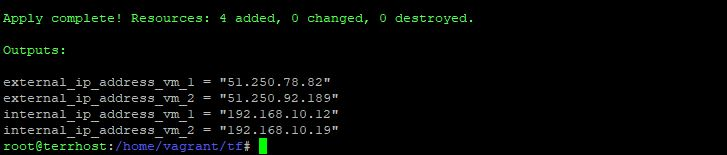
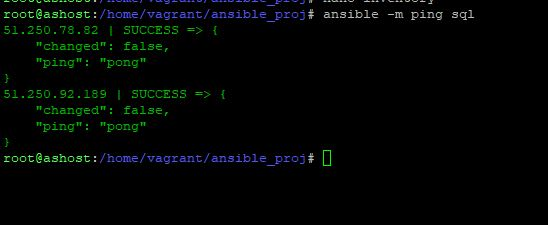
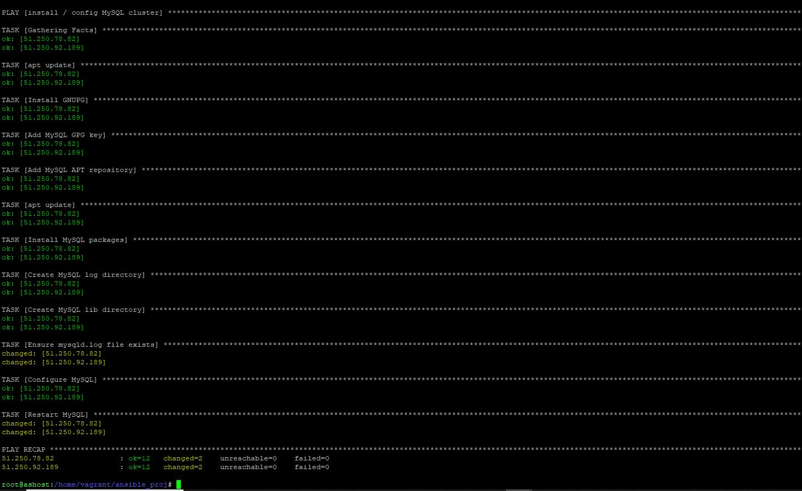
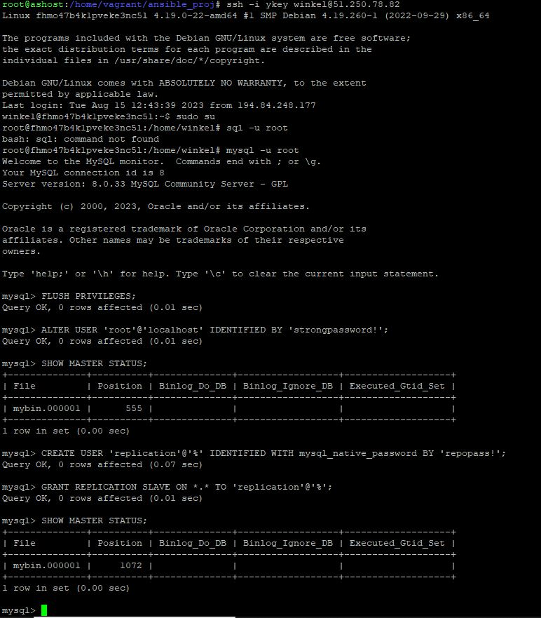
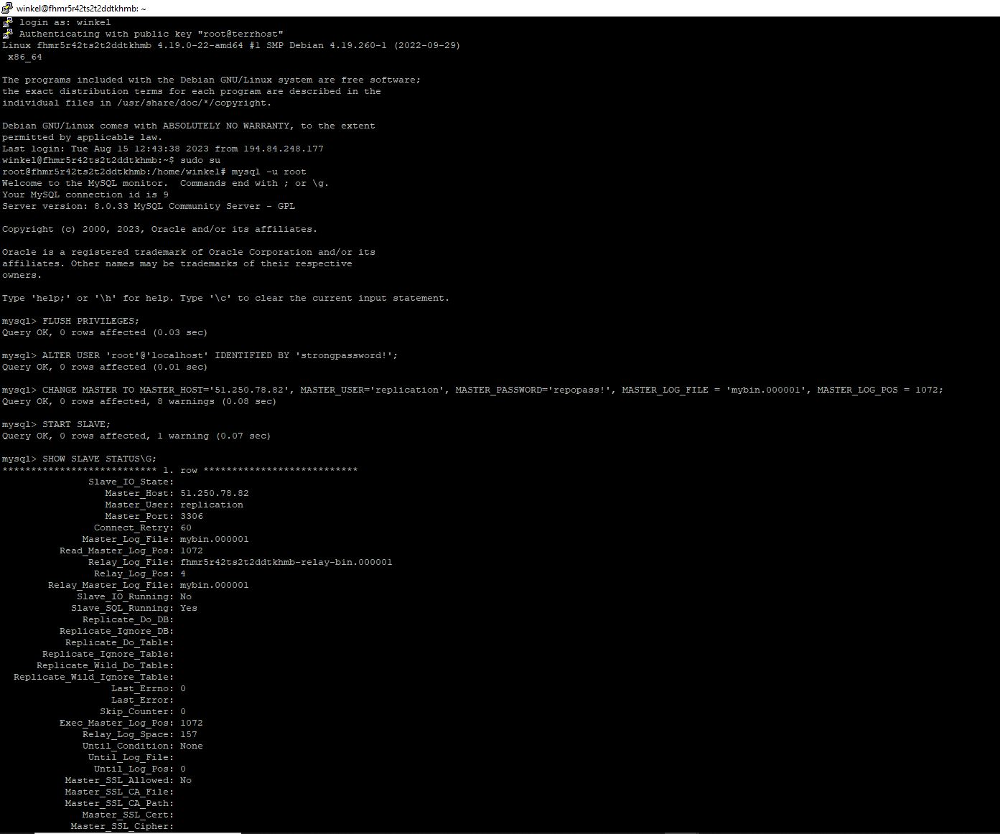

# Домашнее задание к занятию «Репликация и масштабирование. Часть 1», Лебедев А. И., FOPS-10

---

### Задание 1

На лекции рассматривались режимы репликации master-slave, master-master, опишите их различия.

*Ответить в свободной форме.*

### Ответ:  

---

### Задание 2

Выполните конфигурацию master-slave репликации, примером можно пользоваться из лекции.

*Приложите скриншоты конфигурации, выполнения работы: состояния и режимы работы серверов.*  

### Решение:    

- Развернем несколько машин в облаке Yandex Cloud используя Terraform. Сначала я думал, что подниму все в контейнерах, но потом отказался от этой идеи, ввиду большой сложности этой задачи, которая, по сути уже превращается в целый небольшой инфраструктурный комплекс. Было решено использовать облачные хосты, terraform, ansible + руки.

- Я закомментил весь provisioner remote-exec модуль, который должен был разворачивать docker + docker compose и развернул две чистые машины:

  

- Теперь поправим мой хост с ansible, добавим несколько новых серверов, скажем, где на них лежит python, прокинем ключи и сделаем ansible -m ping:

  

- Погнали раскатывать наш плэйбук:

   

- Отлично, позеленело! Отправляемся на наши машины допиливать кластер руками. Можем пойти прямо с моего ansible-хоста, используя команду:

```
ssh -i ykey winkel@51.250.78.82
```

- Проваливаемся в SQL-master, задаем пароль на root-пользователя и делаем все необходимые по заданию вещи. На скриншоте ниже, я еще не знаю, что изменить пароль у меня получится только слегка поправив команду:

```
ALTER USER 'root'@'localhost' IDENTIFIED WITH 'mysql_native_password' BY 'strongpassword!';
``` 

  

 - Делаем все необходимое для создания на SQL-slave и смотрим статус:

  

  - Создадим на мастере базу test_database и проверим работоспособность кластера:


